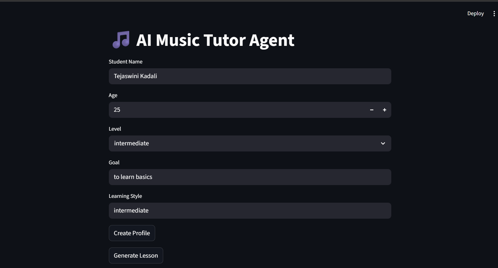
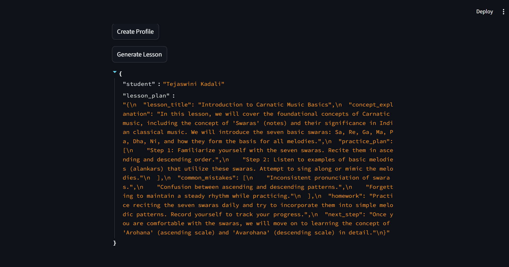

## AI Agent Capabilities

- Maintains student profile
- Tracks learning progress
- Generates structured lesson plans
- Creates quizzes
- Recommends next learning steps dynamically

# AI Music Tutor Agent

An AI-powered personalized music learning agent that creates lesson plans, quizzes, tracks student progress, and recommends next learning steps.

## Features

- Create student profile
- Generate personalized lesson plans
- Create beginner-friendly quizzes
- Track completed lessons and mistakes
- Store confidence history
- Recommend next learning steps
- FastAPI backend
- Streamlit UI

## Tech Stack

- Python
- FastAPI
- OpenAI API
- Pydantic
- JSON-based memory
- Streamlit

## API Endpoints

### Home
**GET /**

### Create Student Profile
**POST /student-profile**

### Generate Lesson Plan
**POST /lesson-plan**

### Generate Quiz
**POST /quiz**

### Update Progress
**POST /progress**

### Recommend Next Step
**POST /recommend-next-step**

## Run Locally

Install dependencies:

```bash
python -m pip install -r requirements.txt

## Screenshots
### UI Demo
 
### lesson plan
